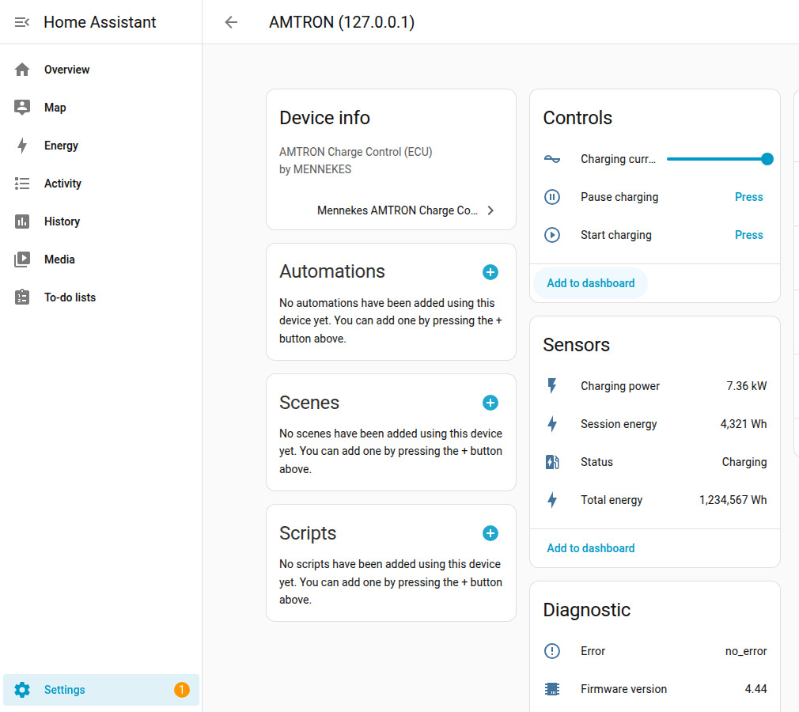
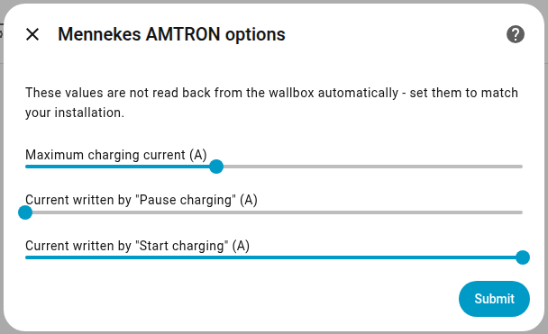
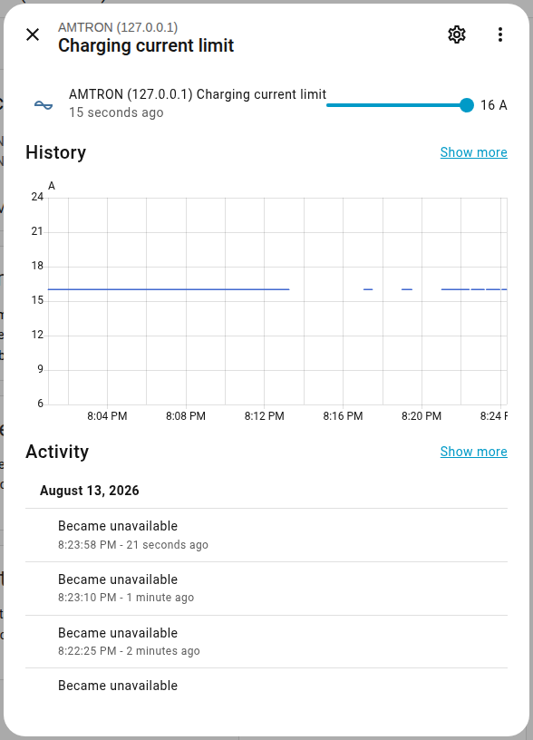
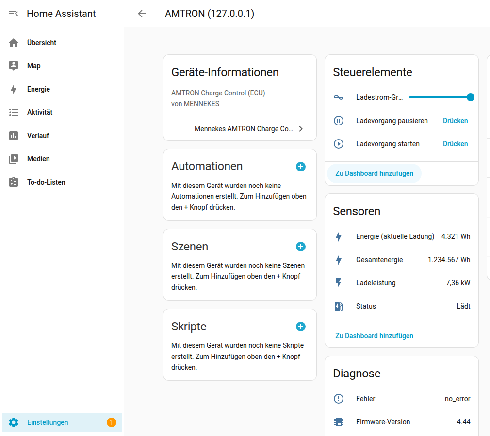
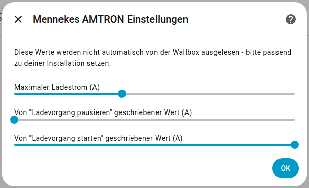
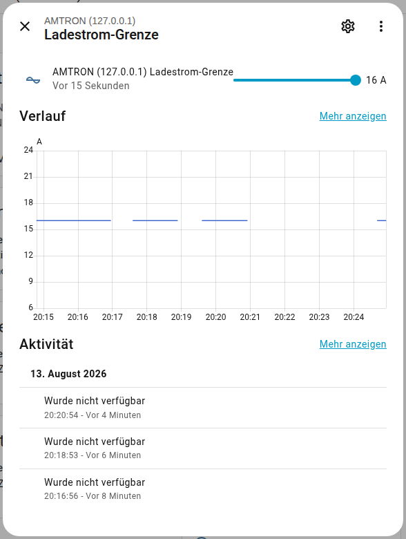

# Mennekes AMTRON Charge Control – Home Assistant Integration

[](https://github.com/TenOfNine/Mennekes-HA-Integration/actions/workflows/ci.yml)
[](https://github.com/TenOfNine/Mennekes-HA-Integration/actions/workflows/hassfest.yaml)


[](https://github.com/hacs/integration)

Custom [Home Assistant](https://www.home-assistant.io/) integration for a **Mennekes AMTRON
Charge Control** wallbox (ECU controller) over local **Modbus TCP** — no cloud, no app, no
pymodbus dependency.

> Built for the ECU controller family (AMTRON Charge Control, AMTRON Professional, AMEDIO
> Professional). AMTRON Xtra/Premium use a different controller (HCC3) with a different
> register map and word order — not compatible with this integration.

## Features

- **Charging power** (kW) — live, from the wallbox's built-in energy meter
- **Charging current limit** (A) — adjustable, with a configurable maximum matching your
  supply circuit's fusing
- **Start charging** — sets a configurable "start current" (16 A by default), then writes a
  synthetic OCPP IdTag (same effect as tapping an RFID card)
- **Pause charging** — writes a configurable "pause current" (0 A by default, per the
  manufacturer's documented pause mechanism)
- **Status**, **session energy**, **total (lifetime) energy**, **system errors**, and
  **firmware version** as additional sensors
- All three configurable currents (max., start, pause) are changeable at runtime via
  **Settings → Devices & Services → Mennekes AMTRON → Configure** — no file edits, no restart.
  The start current is bounded between 6 A and the configured maximum current.
- Optional **1-phase/3-phase switching** — see below.

See [`custom_components/mennekes_amtron/`](custom_components/mennekes_amtron/) for the full
entity list and register-level detail in code comments.

## Phase switching (1-phase / 3-phase)

Off by default. If your unit has phase-switching hardware installed (a relay that can
disconnect L2/L3), you can enable it in **Configure** under **"Phasenumschaltung" / "Phase
switching"**:

| Mode | Effect |
|---|---|
| Disabled *(default)* | Unchanged from above: only the Amp-based **Charging current limit** entity exists. |
| Single-phase only | Adds a **Charging power limit** (W) entity; requests are always clamped to the 1-phase range, never switching to 3-phase. |
| Automatic (1-phase / 3-phase) | Adds the same **Charging power limit** (W) entity; the wallbox switches phases itself depending on the requested power - below 4140 W it charges 1-phase, at or above it charges 3-phase (the wallbox's own documented behavior for this register, not something this integration decides). |

Set the entity to the power you actually want delivered (e.g. `1380` for a minimal 1-phase
charge, `11040` for a full 3-phase 16 A charge); the integration converts it to what the wallbox
expects and enforces the IEC 61851 minimum of 6 A per phase - anything that would fall below
that on the selected phase count is written as `0` (paused) instead, matching the register's own
documented meaning for that value.

**This is separate from, and independent of, the plain Amp-based current control above** - the
two use different registers (`HEMS_CURRENT_LIMIT` vs `HEMS_POWER_LIMIT`) and are not meant to be
used at the same time. Unlike `HEMS_CURRENT_LIMIT`, `HEMS_POWER_LIMIT` has **not been directly
confirmed against physical hardware by this project** - it's cross-referenced from the same ECU
Modbus TCP Server Specification via secondary sources (community reports for AMTRON/ECU-family
devices) rather than the primary manufacturer PDF. Only enable a non-default mode if your
installation actually has the phase-switching relay, and verify behavior carefully against your
own unit before relying on it.

## Screenshots

The device page in Home Assistant, showing every entity the integration provides (values are
from a live demo session):



The **Configure** dialog (Settings → Devices & Services → Mennekes AMTRON → Configure), where
the three writable currents are set:



The charging-current-limit entity's own dialog, with its history graph:



<details>
<summary>Same screenshots in German (Home Assistant UI set to Deutsch)</summary>





</details>

## Why no pymodbus?

This integration ships a minimal, dependency-free Modbus TCP client
(`modbus_client.py`, plain `asyncio` + `struct`). Two reasons:

1. Mennekes' Modbus TCP servers document a single simultaneous connection and no keepalive
   support — a short-lived connection per request is the robust approach here, not a
   workaround.
2. Home Assistant's built-in `modbus` integration pins its own pymodbus version. A
   custom_component pinning a *different* version is a well-known source of dependency
   resolution failures for anyone who also uses core Modbus. Not declaring the dependency at
   all avoids that failure mode entirely.

## Requirements

- AMTRON Charge Control (or Professional / AMEDIO Professional) with **firmware ≥ 5.12.x**
  (baseline for the Modbus TCP interface). Some registers this integration uses were
  cross-checked against community reports recommending **≥ 5.22**; if setup fails outright,
  updating firmware is a reasonable first step (mennekes.de → eMobility → Services →
  Software-Updates).
- Wallbox and Home Assistant on the same network.
- Modbus TCP **and** the "kostenloses Laden" (free charging) authorization exception enabled
  on the wallbox — see [Wallbox setup](#wallbox-setup) below.

## Wallbox setup

1. Log into the wallbox's web interface as **Operator**.
2. **Lastmanagement** → set **Modbus TCP** to on.
3. Set the **Modbus register set** to **"Mennekes"** (see [Troubleshooting](#troubleshooting)
   if this doesn't work).
4. Still under **Lastmanagement**, enable **"Modbus Slave Allow Start/Stop Transaction"**.
5. **Authorisierung** → set **"kostenloses Laden"** to on. Without this, the start command
   this integration sends is rejected like an unrecognised RFID card, since it isn't on any
   whitelist.
6. Save and reboot the wallbox.

Modbus TCP is then reachable on **port 502**, unit ID **255**.

## Installation

### HACS (custom repository)

1. HACS → the **⋮** menu (top right) → **Custom repositories**
2. Add this repository's URL, category **Integration**
3. Search for **"Mennekes AMTRON Charge Control"** in HACS and install
4. Restart Home Assistant

### Manual

1. Copy `custom_components/mennekes_amtron/` into `<config>/custom_components/`
2. Restart Home Assistant

### Both methods, then

**Settings → Devices & Services → Add Integration** → search for **"Mennekes AMTRON"** →
enter the wallbox's IP address (port `502` and unit ID `255` are pre-filled).

Setup performs a real Modbus read against the wallbox immediately, so a misconfiguration
shows up as an error in the dialog rather than a silent, non-functional "success".

## Troubleshooting

The setup dialog shows the actual Modbus error text (e.g. `Illegal function`,
`Illegal data address`) rather than a generic message — this alone usually narrows the cause
down immediately.

| Symptom | Likely cause |
|---|---|
| `Illegal function` | The wallbox only accepts **function code 3** (Read Holding Registers) for these registers, not function code 4 — despite the manufacturer's document labelling them "READ". This integration always uses function code 3; confirmed against community reports for the Charge Control specifically. |
| Persistent Modbus errors regardless of function code | Register set may be set to an alternative like `TQDM100` instead of `Mennekes` in the wallbox UI — see [Wallbox setup](#wallbox-setup), step 3. |
| Connects, but `Illegal data address`, or unit ID issues | Default unit ID is 255 (most common), but at least one report used **unit ID 1** instead. Try 1 if 255 fails. |
| `start_charging` has no effect | Confirm both "Modbus Slave Allow Start/Stop Transaction" and "kostenloses Laden" are enabled (steps 4–5 above). |

## Development

```bash
pip install -r requirements-dev.txt
ruff check .
pytest tests/ -v
```

Tests run against a fake Modbus TCP server and a small local stand-in for `homeassistant`
(see [`tests/stubs/README.md`](tests/stubs/README.md) for why) — no real Home Assistant
install needed to run them. `hassfest` (manifest/translation schema) runs in CI on every push.

## Register map source

- MENNEKES: *"ECU-BRx and ECU-BBx Modbus TCP Server Specification"*, Doc. Revision 1.07 — the
  official protocol document for AMEDIO Professional, AMTRON Professional, and AMTRON Charge
  Control.
- Setup steps and known pitfalls cross-checked against a community integration guide
  (nymea.energy) and a forum thread on Modbus TCP access to the Charge Control (SPS-Forum).

## License

[MIT](LICENSE) — do what you like with it; no warranty.

## Contributing

Issues and pull requests welcome. This is a small, single-purpose integration for one
wallbox family — if you're adding support for a different Mennekes controller (e.g. the
HCC3-based Xtra/Premium), a separate integration is probably cleaner than branching this one.
